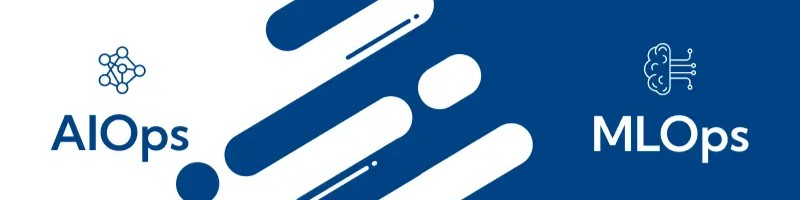

  

# Hi there, I am Salman 👋

I am a research engineer in a French engineering lab 🔬. In parallel, I am also an adjunct professor in a French university 🎓 and am working as a council member in a working group of [Grenoble Alpes Metropole](https://c2d.grenoblealpesmetropole.fr/1409-qui-sommes-nous.htm) 👨‍⚖️🏛️.

I completed my [PhD in Energy Flexibility 🪫🎚️🔋 from Université Grenoble Alpes](https://theses.hal.science/tel-03766410v1). I love to develop data science projects 📊📈👨🏻‍💻 in Python 🐍 and automate them using shell scripts 💲 on linux servers 🐧⭐️. Here are some of the stuff I enjoy doing:

* Working with data 💾 and APIs 🔗🌐
* Time series analysis and forecasting 📈📉
* Working on NLP 📄 and AI Agents 🤖
* Automating stuff 🛠️ in production 🏭📦

Here are the stacks on which I gained expertise:

### 🖥️ Operating Systems & Core Environment

<!--  -->

### 🗄️ Databases & Storage

<!-- 

 -->

### 🐍 Languages & Development Tooling

<!--  -->

### 📊 Data Analysis & Big Data

<!--  -->
<!-- 
 -->
<!-- 
 -->

### 🧠 Machine Learning

### ⚙️ DevOps / MLOps / AIOps Orchestration

<!-- 
 -->
<!-- 
 -->

### 🤖 AIOps, GenAI & Agentic Workflows

<!--  -->
